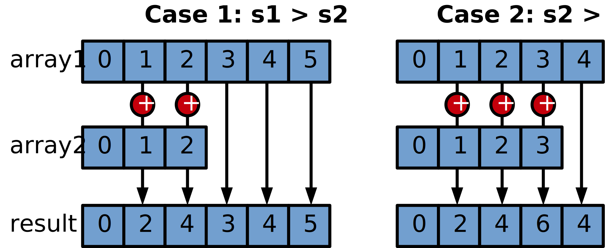

The program [vector.cpp](vector.cpp) initialize two arrays `array1` and
`array2` of variable sizes s1 and s2, and a third array with a size equal to
max(s1, s2). The program then initializes `array1` and `array2` with increasing
numbers from from 0 to the size of the corresponding array. Finally, it adds up
elements of these arrays into the third one as depicted on the picture below,
before printing the content of the result array.



Rewrite this program to use `vector`s rather than C-style arrays for `array1`,
`array2` and `result_array`. Your program should:

- Have no calls to `malloc`/`free`
- Not include size-related parameters in the functions `add_arrays` and `init_array`

As a stretch goal, can you replace `init_array` with a standard library algorithm?

An example of expected output is:
```shell
./vector 5 10     
0 2 4 6 8 5 6 7 8 9
```

To check the correctness of your program, use the department VM image with check50 installed or alternatively CS50 [sandbox](sandbox.cs50.io)
or [IDE](ide.cs50.io) and write it in a file named `vector.cpp`. In a
terminal, with that file in the local directory, check with this command:
```shell
check50 -l --ansi-log ppetoumenos/comp26020-problems/2022-2023/week7-cpp-generic/03-vector
```
